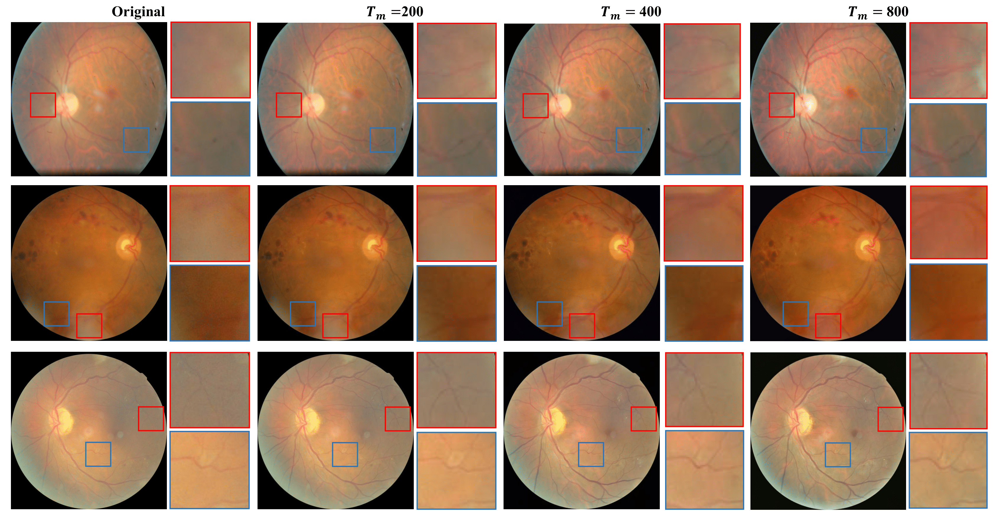
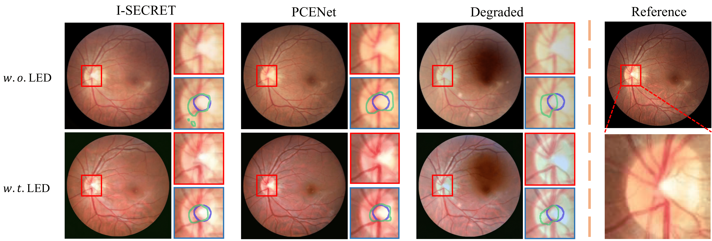
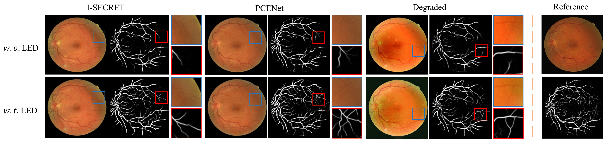
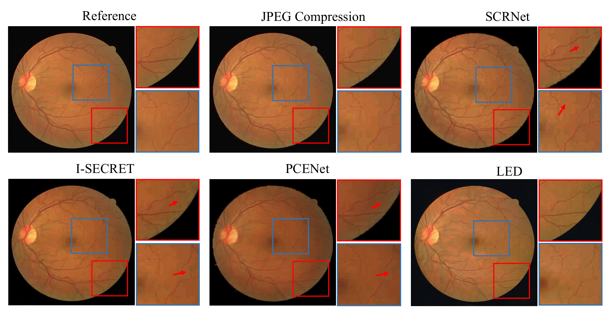
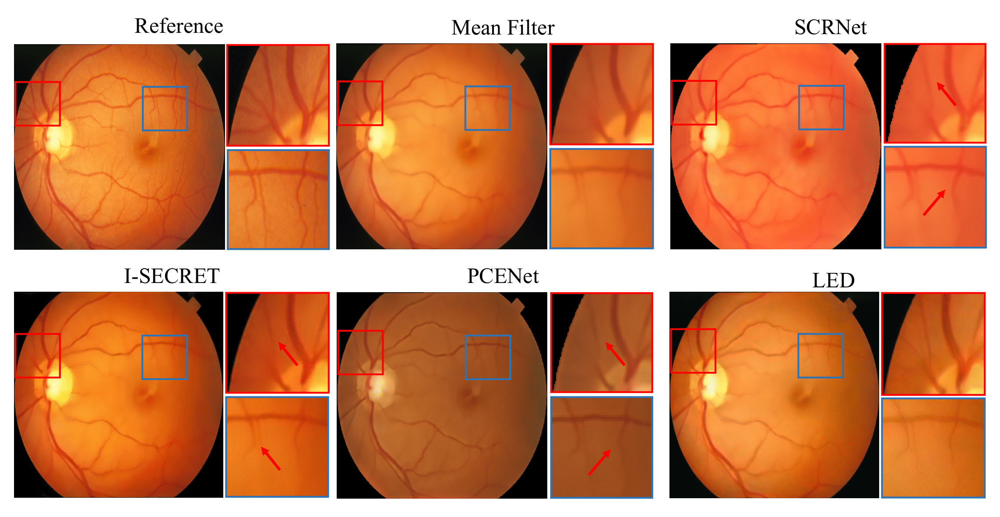
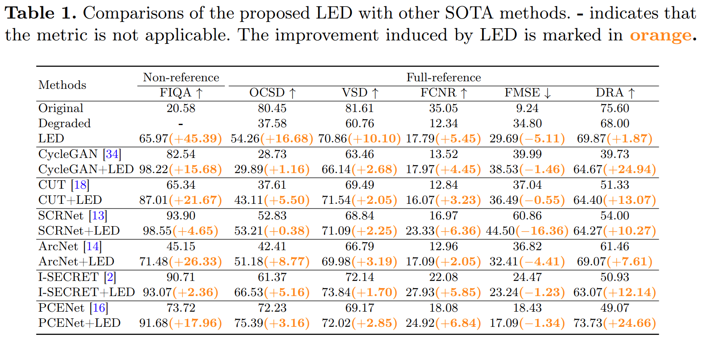

# Learning Enhancement From Degradation: A Diffusion Model For Fundus Image Enhancement

The official implementation of the paper ``Learning Enhancement From Degradation: A Diffusion Model For Fundus Image Enhancement``. The related paper link will be updated soon.


## Highlights
- ### Continuous and reliable enhancement


- ### Flexable and ffectively integrated into any SOTA




- ### Robust for OOD low-quality images




- ### SOTA performance


Start LED with few lines

```python
from led.pipelines.led_pipeline import LEDPipeline
led = LEDPipeline()
led.cuda()
led_enhancement = led('./doc/example.jpeg')[0]
```

Furthermore, you can combine LED with any existing SOTA methods as external backend. Current supported backends include:
- I-SECRET
- PCE-Net

Try
```python
led = LEDPipeline(backend='I-SECRET', num_cond_steps=200)
```

For more details, please read example.ipynb.

## Catalog
- [ ] Training guidance
- [ ] Support for ArcNet and SCRNet
- [ ] Add related codes for data-driven degradation
- [x] Inference pipeline

## Train
For training your own LED, you need to update few lines in configs/train_led.yaml
```yaml
    train_good_image_dir: # update to training hq images directrory
    train_bad_image_dir: # update to training lq images directrory
    train_degraded_image_dir: # update to training degraded images directrory
    val_good_image_dir:  # update to validation hq images directrory
    val_bad_image_dir: # update to validation lq images directrory
```
Please note that ``train_degraded_image_dir`` should contain degraded high-qualty images by any data-driven methods. We will inculde related codes in our future workspace. However, you can consider using some existing repos instead, like [CUT](https://github.com/taesungp/contrastive-unpaired-translation) or [CycleGAN](https://github.com/junyanz/pytorch-CycleGAN-and-pix2pix).

To train LED, simply  run
```bash
accelerate launch  --mixed_precision fp16 --gpu_ids 0 --num_processes 1 script/train.py 
```
More GPUs will take significant performance improvement.


## Acknowledgement 
Thanks for [PCENet](https://github.com/HeverLaw/PCENet-Image-Enhancement), [ArcNet](https://github.com/liamheng/Annotation-free-Fundus-Image-Enhancement) and [SCRNet](https://github.com/liamheng/Annotation-free-Fundus-Image-Enhancement) for sharing their powerful pre-trained weights! Thansk for [diffusers](https://github.com/huggingface/diffusers) for sharing codes.

## Citation

If this work is helpful for your research, please consider citing the following BibTeX entry.

```
Will be updated 
```
## License
This repository is released under the Apache 2.0 license as found in the [LICENSE](LICENSE) file.